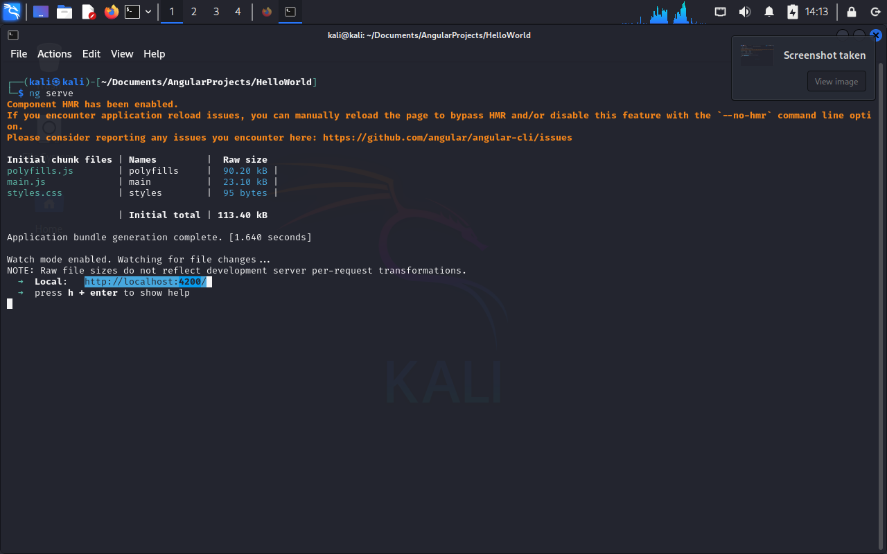

# Configuración de un Proyecto Angular en una máquina virtual con Kali Linux.

## 1. Título

Configuración y Ejecución de un Proyecto Angular en Máquina Virtual con Kali Linux

## 2. Tiempo de duración

1 hora

## 3. Fundamentos:

En esta práctica se trabajó en la configuración de un proyecto básico de Angular dentro de una máquina virtual utilizando Kali Linux. El enfoque principal fue preparar el entorno de desarrollo desde cero, usando exclusivamente la terminal y comandos de Linux para cada paso.

Kali, a pesar de estar orientado a tareas de ciberseguridad, al estar basado en Debian permite una gestión eficiente de paquetes y configuraciones necesarias para desarrollo web. Se utilizó la terminal para actualizar los repositorios del sistema con sudo apt update y luego instalar Node.js y npm, herramientas fundamentales para trabajar con Angular. Posteriormente, se instaló el Angular CLI globalmente usando npm install -g @angular/cli, lo que permitió ejecutar comandos como ng new para crear el nuevo proyecto.

Esta actividad permitió aplicar conocimientos relacionados con el uso del sistema operativo Kali en tareas fuera del pentesting, demostrando que es posible convertirlo en una plataforma funcional para desarrollo. Además, se reforzó el uso de comandos de Linux, que son claves para manipular paquetes, moverse entre carpetas, dar permisos, instalar dependencias y ejecutar scripts.

## 4. Conocimientos previos.

Para realizar esta practica el estudiante necesita tener claro los siguientes temas:

- Uso de máquinas virtuales para usar sistemas basados en Linux.
- Comandos básicos de Linux
- Uso de la terminal dentro de Kali Linux
- Conocimiento básico de elaboración de un proyecto web.
- Gestores de paquetes dentro de Linux.

## 5. Objetivos a alcanzar

- Ejecutar un proyecto de Angular en Linux usando una máquina virtual con Kali Linux.
- Comprender instalaciones dentro de sistemas basados en Linux.

## 6. Equipo necesario:

- Computador con sistema operativo Windows.
- Software de virtualización de sistemas operativos(en mi caso VMWare 17 pro)
- Documentaciones Oficiales

## 7. Material de apoyo.

- [Documentación de Angular](https://angular.io/)

- [Documentación Kali Linux ](https://www.kali.org/docs/)
- Guía de comandos básicos de Linux.
- Guía video colocado en la plataforma virtual del Instituto: https://drive.google.com/file/d/1OitqZ02pX7VHaVx3qH9eF31mQent65rk/view

## 8. Procedimiento

Paso 1: Descargar e instalar VMware Workstation Player:

- Descargar en: [VMWARE](https://www.vmware.com/go/downloadplayer)


Paso 2: Descargar la imagen ISO de Kali Linux

- Descargar en [Sitio de descarga de Kali Linux](https://www.kali.org/get-kali/#kali-platforms) y seleccionar la plataforma de uso, en este caso Virtual Machine:
  

Paso 3: Crear la máquina virtual con Kali Linux

- Abrir VMware Workstation Player.

- Seleccionar "Create a New Virtual Machine".

- Elegir "Installer disc image file (iso)" y cargar la ISO de Kali Linux.

- Seleccionar el sistema operativo como Linux y versión Debian 11.x 64-bit (o la más cercana).

- Asignar nombre y ubicación a la máquina virtual.

- Asignar recursos recomendados:

- Memoria RAM: mínimo 2 GB (recomendado 4 GB o más).

- Disco duro: mínimo 20 GB (recomendado 40 GB).

- Finalizar y encender la máquina virtual.


Paso 4: Iniciar Kali Linux:


Paso 5: Actualizar Kali Linux:

```bash
sudo apt update
sudo apt upgrade -y
```

- Captura:
  
  
  Paso 6: Instalar Node.js y npm:

```bash
sudo apt install nodejs -y
sudo apt install npm -y
```

- Captura:
  
  

Paso 7: Instalar Angular CLI:

```bash
sudo npm install -g @angular/cli
```

- Captura:
  

Paso 8: Crear carpeta para proyectos Angular:

```bash
mkdir angular-projects
cd angular-projects
```

- Captura:
  
  Paso 9: Crear un nuevo proyecto Angular:

```bash
ng new nombre-del-proyecto
```

- Captura:
  

Paso 10: Ejecutar el servidor de desarrollo:

```bash
cd nombre-del-proyecto
ng serve
```

- Captura:
  
  

## 9. Resultados esperados:

Al finalizar correctamente esta práctica, se espera que el entorno de desarrollo Angular esté completamente operativo dentro de la máquina virtual Kali Linux. Los resultados esperados incluyen:

- La máquina virtual con Kali Linux instalada y configurada correctamente mediante VMware.
- El sistema Kali actualizado y con conectividad a internet funcional dentro de la máquina virtual.
- Node.js y npm instalados, verificados y funcionando correctamente a través de la terminal.
- Angular CLI instalado globalmente y accesible desde cualquier ubicación del sistema.
- Un proyecto Angular creado exitosamente utilizando el comando `ng new`, con su estructura de archivos generada automáticamente.
- El servidor de desarrollo Angular (`ng serve`) ejecutándose sin errores y accesible desde el navegador en la dirección `http://localhost:4200`.
- La interfaz inicial de Angular visible en el navegador, mostrando el mensaje de bienvenida por defecto del framework.

Este entorno básico permite iniciar el desarrollo de aplicaciones Angular SPA (Single Page Applications) directamente desde Kali Linux, empleando herramientas modernas y completamente gestionado desde la terminal.

## 10. Bibliografía

- Angular Developers. (s.f.). _Angular Documentation_. Recuperado de [https://angular.io/docs](https://angular.io/docs)

## Audio Explicativo:

[Audio](https://drive.google.com/file/d/1taj7yOHwjbViMmuwewUfPtgNCENmlIr5/view?usp=sharing)
