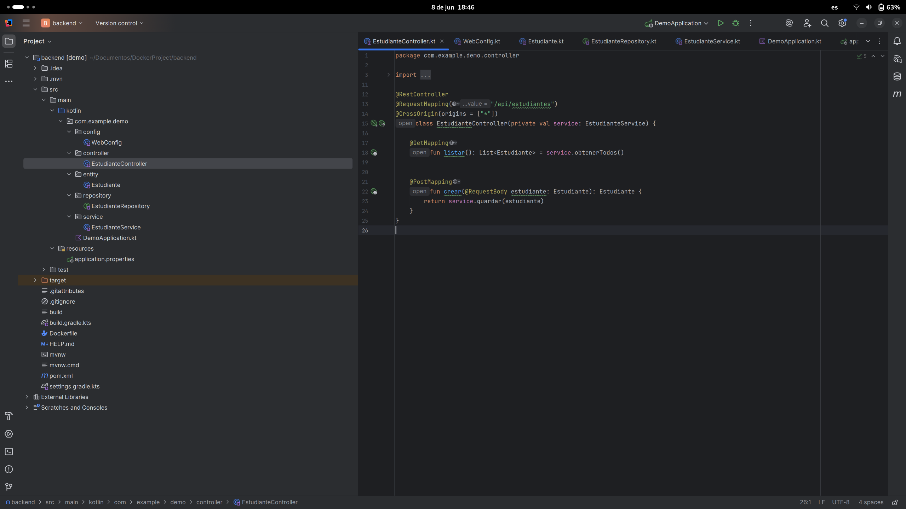

# Práctica Contenerización Frontend React con Backend API usando Docker

## 1. Título  
Contenerización de una aplicación frontend React para mostrar datos desde una API REST backend en Docker Compose

## 2. Tiempo de duración  
90 minutos

## 3. Fundamentos  

Docker permite empaquetar aplicaciones y sus dependencias en contenedores, asegurando que funcionen de forma consistente en cualquier entorno.  
En esta práctica, se crea y orquesta una aplicación frontend desarrollada con React, la cual consume datos desde una API REST backend. Ambos servicios se ejecutan en contenedores Docker separados y se comunican a través de una red Docker definida en Docker Compose.  
Se configura un proxy inverso con nginx para que las solicitudes al API desde el frontend se redirijan correctamente al backend, facilitando la comunicación entre contenedores.

## 4. Conocimientos previos  

- Fundamentos de desarrollo frontend con React  
- Fundamentos de desarrollo backend con APIs REST  
- Comandos básicos de Docker y Docker Compose  
- Conceptos de redes en Docker  
- Variables de entorno en Docker y React (Vite)  
- Proxy inverso con nginx  

## 5. Objetivos a alcanzar  

- Crear un contenedor Docker para la aplicación frontend React  
- Crear un contenedor Docker para la API REST backend  
- Configurar nginx como proxy inverso para enrutar tráfico del frontend al backend  
- Establecer comunicación entre frontend y backend usando una red Docker personalizada  
- Visualizar datos dinámicos en una tabla React obtenidos desde la API backend  
- Construir las imágenes Docker y levantar el entorno con docker-compose  

## 6. Equipo necesario  

- Computadora con Docker y Docker Compose instalados  
- Node.js y npm (para desarrollo local del frontend React)  
- Editor de código (VSCode recomendado)  
- Navegador web para pruebas  

## 7. Material de apoyo  

- [Documentación oficial de Docker](https://docs.docker.com/)  
- [React Documentation](https://reactjs.org/docs/getting-started.html)  
- [Vite Documentation](https://vitejs.dev/guide/)  
- [nginx Docs](https://nginx.org/en/docs/)  
- [Docker Compose Networking](https://docs.docker.com/compose/networking/)  

## 8. Procedimiento  

### Paso 1: Crear el proyecto backend (API REST)  

- Crear un proyecto backend con el framework de preferencia (por ejemplo, Spring Boot, Node.js, etc.)  
- Implementar un endpoint que devuelva un arreglo JSON con los datos de la entidad (estudiantes, clientes, productos, etc.)  
- Probar el endpoint localmente para verificar que devuelve datos correctos 



### Paso 2: Crear el proyecto frontend con React y Vite  

- Crear un proyecto React usando Vite  
- Crear una interfaz para obtener los datos desde la API backend usando `fetch`  
- Implementar una tabla que muestre los datos recibidos (id, nombre, carrera, etc.)  
- Asegurar que las interfaces y los tipos coincidan con la respuesta del backend  
- Configurar las peticiones en React para usar rutas relativas con prefijo `/api` (ejemplo: `fetch('/api/estudiantes')`) para aprovechar el proxy inverso de nginx  


### Paso 3: Crear el Dockerfile para el backend  

- Definir la imagen base y pasos para construir y ejecutar la API backend  

```dockerfile
# Etapa 1: Construcción
FROM gradle:8.5-jdk17 AS build
WORKDIR /app
COPY . .
RUN rm -f build
RUN gradle build -x test

# Etapa 2: Ejecución
FROM eclipse-temurin:17-jdk-alpine
WORKDIR /app
COPY --from=build /app/build/libs/*.jar app.jar
EXPOSE 8080
ENTRYPOINT ["java", "-jar", "app.jar"]
```


### Paso #: Crear el Dockerfile para el frontend

```
# Etapa de build
FROM node:18-alpine as build
WORKDIR /app

COPY package.json package-lock.json* ./
RUN npm install

COPY . .

RUN npm run build

# Etapa de producción
FROM nginx:stable-alpine
COPY --from=build /app/dist /usr/share/nginx/html
COPY nginx.conf /etc/nginx/conf.d/default.conf

EXPOSE 80
CMD ["nginx", "-g", "daemon off;"]
```


### Paso 5: Configurar nginx para proxy inverso
Crear un archivo nginx.conf con el siguiente contenido:

```
server {
  listen 80;

  location / {
    root /usr/share/nginx/html;
    index index.html;
    try_files $uri /index.html;
  }

  location /api/ {
    proxy_pass http://backend:8080;
    proxy_set_header Host $host;
    proxy_set_header X-Real-IP $remote_addr;
  }
}
```
Esta configuración permite que el frontend sirva los archivos estáticos y que todas las solicitudes con prefijo /api se redirijan al backend, evitando problemas de CORS.


### Paso 6: Crear el archivo docker-compose.yml

```
version: "3.8"

services:
  postgres:
    image: postgres:15
    restart: always
    environment:
      POSTGRES_DB: estudiantesdb
      POSTGRES_USER: admin
      POSTGRES_PASSWORD: admin123
    volumes:
      - pgdata:/var/lib/postgresql/data
    ports:
      - "5432:5432"
    networks:
      - app-network

  pgadmin:
    image: dpage/pgadmin4
    container_name: pgadmin
    restart: always
    environment:
      PGADMIN_DEFAULT_EMAIL: admin@admin.com
      PGADMIN_DEFAULT_PASSWORD: admin123
    ports:
      - "5050:80"
    volumes:
      - pgadmin_data:/var/lib/pgadmin
    depends_on:
      - postgres
    networks:
      - app-network

  backend:
    build:
      context: ./backend
      dockerfile: Dockerfile
    container_name: backend
    ports:
      - "8080:8080"
    environment:
      SPRING_DATASOURCE_URL: jdbc:postgresql://postgres:5432/estudiantesdb
      SPRING_DATASOURCE_USERNAME: admin
      SPRING_DATASOURCE_PASSWORD: admin123
    depends_on:
      - postgres
    networks:
      - app-network

  frontend: 
    build:
      context: ./frontend
      dockerfile: Dockerfile
    container_name: frontend
    ports:
      - "3000:80"
    depends_on:
      - backend
    networks:
      - app-network

volumes:
  pgdata:
  pgadmin_data:

networks:
  app-network:
    driver: bridge
```

### Paso 7: Construir y levantar los contenedores  

```bash
docker compose build --no-cache
docker compose up -d
```


## 9. Resultados esperados:
- El frontend React debe estar corriendo en un contenedor Nginx y mostrar datos dinámicos obtenidos desde el backend.

- La comunicación entre frontend y backend debe funcionar correctamente usando nginx como proxy inverso.

- PostgreSQL debe estar corriendo y accesible, administrable mediante pgAdmin.

- Todos los contenedores deben estar conectados a la red Docker personalizada app-network.

- El uso de multi-stage builds reduce el tamaño de las imágenes y mejora la eficiencia en la construcción.

## 10. Bibliografía
- Docker. (s.f.). Docker Documentation. Recuperado de https://docs.docker.com/

- React Documentation. (s.f.). Recuperado de https://reactjs.org/docs/getting-started.html

- Vite Documentation. (s.f.). Recuperado de https://vitejs.dev/guide/

- nginx Docs. (s.f.). Recuperado de https://nginx.org/en/docs/

- Docker Compose Networking. (s.f.). Recuperado de https://docs.docker.com/compose/networking/

[Audio explicativo práctica](https://drive.google.com/file/d/14jP4q-tnDs1JT4LVMEgVks4VIwmQMlqO/view?usp=sharing)
