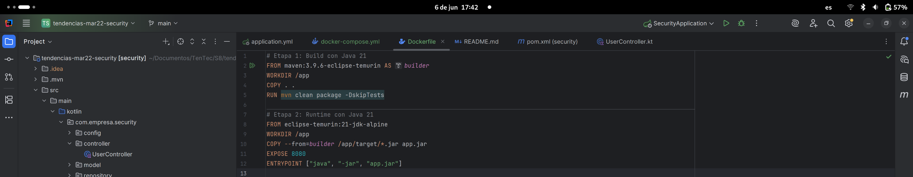

# Práctica Servidor Backend con Docker: Spring Boot, PostgreSQL y pgAdmin

## 1. Título  
Automatización del despliegue de una aplicación backend con PostgreSQL y pgAdmin usando Docker y Docker Compose

## 2. Tiempo de duración  
90 minutos

## 3. Fundamentos  

Docker permite contenerizar aplicaciones y sus dependencias, asegurando consistencia en entornos locales y productivos.  
En esta práctica, se automatiza el despliegue de una aplicación backend basada en Spring Boot conectada a una base de datos PostgreSQL, y se incluye pgAdmin como herramienta visual de administración.  
Se utiliza `docker-compose` para orquestar los servicios, definiendo redes personalizadas y volúmenes persistentes. Además, se emplean técnicas de construcción multi-stage para optimizar la imagen final de la aplicación.

## 4. Conocimientos previos  

- Fundamentos de aplicaciones backend (Spring Boot)
- Comandos básicos de Docker y Docker Compose
- Conceptos de redes y volúmenes en Docker
- Variables de entorno y conexión a base de datos
- Fundamentos básicos de PostgreSQL

## 5. Objetivos a alcanzar  

- Crear servicios de PostgreSQL y pgAdmin en Docker Compose
- Configurar volúmenes y redes personalizadas
- Crear un `Dockerfile` para contenerizar la aplicación backend
- Aplicar multi-stage builds para optimizar la imagen
- Validar conexión entre aplicación backend y base de datos
- Acceder a pgAdmin y verificar conexión con PostgreSQL

## 6. Equipo necesario  

- Computadora con Docker y Docker Compose instalados
- Java 17+ y Maven
- Navegador Web
- Editor de código (VSCode recomendado)

## 7. Material de apoyo  

- [Documentación oficial de Docker](https://docs.docker.com/)
- [Spring Boot Reference](https://spring.io/projects/spring-boot)
- [PostgreSQL Documentation](https://www.postgresql.org/docs/)
- [pgAdmin Docs](https://www.pgadmin.org/docs/)
- [Dockerfile Multi-Stage Builds](https://docs.docker.com/build/building/multi-stage/)

## 8. Procedimiento  

### Paso 1: Clonar el proyecto base  

```bash
git clone https://github.com/maguaman2/tendencias-mar22-security.git
cd tendencias-mar22-security
```


### Paso 2: Crear archivo .env con variables de entorno

```
POSTGRES_DB=appdb
POSTGRES_USER=admin
POSTGRES_PASSWORD=admin123
PGADMIN_DEFAULT_EMAIL=admin@admin.com
PGADMIN_DEFAULT_PASSWORD=admin123
SPRING_DATASOURCE_URL=jdbc:postgresql://postgres:5432/appdb
SPRING_DATASOURCE_USERNAME=admin
SPRING_DATASOURCE_PASSWORD=admin123
```

### Paso 3: Crear docker-compose.yml
```
version: '3.8'
services:
  postgres:
    image: postgres:15
    container_name: postgres_container
    restart: always
    environment:
      POSTGRES_USER: admin
      POSTGRES_PASSWORD: admin
      POSTGRES_DB: tendencias_db
    volumes:
      - postgres_data:/var/lib/postgresql/data
    networks:
      - backend_net

  pgadmin:
    image: dpage/pgadmin4
    container_name: pgadmin_container
    restart: always
    ports:
      - "8080:80"
    environment:
      PGADMIN_DEFAULT_EMAIL: admin@admin.com
      PGADMIN_DEFAULT_PASSWORD: admin
    volumes:
      - pgadmin_data:/var/lib/pgadmin
    networks:
      - backend_net
    depends_on:
      - postgres

  backend:
    build:
      context: .
      dockerfile: Dockerfile
    container_name: backend_container
    ports:
      - "8081:8081"
    depends_on:
      - postgres
    environment:
      SPRING_DATASOURCE_URL: jdbc:postgresql://postgres:5432/tendencias_db
      SPRING_DATASOURCE_USERNAME: admin
      SPRING_DATASOURCE_PASSWORD: admin
    networks:
      - backend_net

volumes:
  postgres_data:
  pgadmin_data:

networks:
  backend_net:


```


### Paso 4: Crear el Dockerfile con multi-stage

```
# Etapa 1: Build con Java 21
FROM maven:3.9.6-eclipse-temurin AS builder
WORKDIR /app
COPY . .
RUN mvn clean package -DskipTests

# Etapa 2: Runtime con Java 21
FROM eclipse-temurin:21-jdk-alpine
WORKDIR /app
COPY --from=builder /app/target/*.jar app.jar
EXPOSE 8080
ENTRYPOINT ["java", "-jar", "app.jar"]


```



- Figura 3. Creación de contenedor de MySQL.


### Paso 5: Levantar la infraestructura

```bash
docker-compose up --build -d
```

- Figura 4: Creación de contenedor de Wordpress.


### Paso 6: Verificar servicios activos

- Aplicación backend: http://localhost:8080

- pgAdmin: http://localhost:5050


## 9. Resultados esperados:
    
- La aplicación backend debe estar corriendo y conectada exitosamente a PostgreSQL.

- pgAdmin debe mostrar las bases de datos y permitir su administración visual.

- Todos los contenedores deben estar conectados por una red personalizada (backend-net).

- El tamaño de la imagen se reduce usando multi-stage builds.


## 10. Bibliografía

- Docker. (s.f.). Docker Documentation. Recuperado de https://docs.docker.com/

- PostgreSQL Global Development Group. (s.f.). PostgreSQL Documentation. https://www.postgresql.org/docs/

- pgAdmin. (s.f.). pgAdmin Documentation. https://www.pgadmin.org/docs/

- Spring Boot. (s.f.). Spring Boot Reference Guide. https://spring.io/projects/spring-boot

## Audio Explicativo:

[Audio explicativo práctica]()