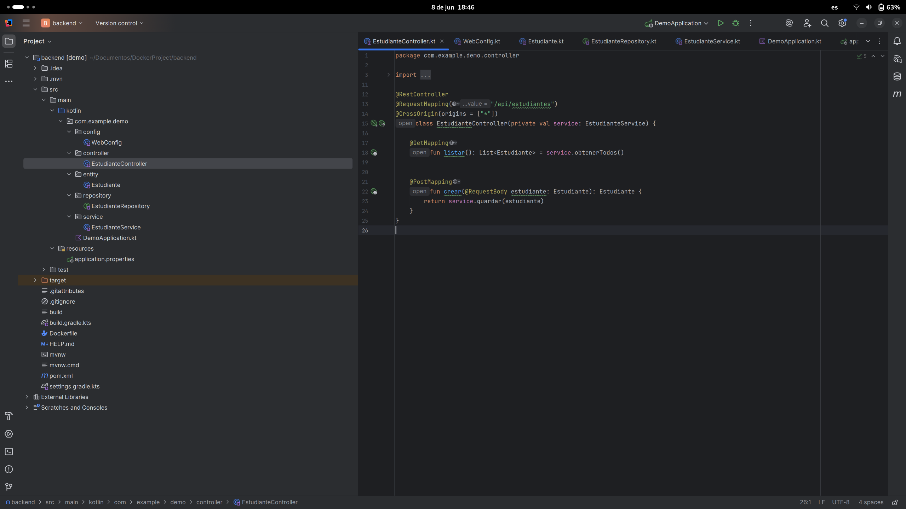

# Práctica Contenerización Frontend React con Backend API usando Docker

## 1. Título  
Contenerización de una aplicación frontend React para mostrar datos desde una API REST backend en Docker Compose

## 2. Tiempo de duración  
90 minutos

## 3. Fundamentos  

Docker permite empaquetar aplicaciones y sus dependencias en contenedores, asegurando que funcionen de forma consistente en cualquier entorno.  
En esta práctica, se crea y orquesta una aplicación frontend desarrollada con React, la cual consume datos desde una API REST backend. Ambos servicios se ejecutan en contenedores Docker separados y se comunican a través de una red Docker definida en Docker Compose.  
Se configura un proxy inverso con nginx para que las solicitudes al API desde el frontend se redirijan correctamente al backend, facilitando la comunicación entre contenedores.

## 4. Conocimientos previos  

- Fundamentos de desarrollo frontend con React  
- Fundamentos de desarrollo backend con APIs REST  
- Comandos básicos de Docker y Docker Compose  
- Conceptos de redes en Docker  
- Variables de entorno en Docker y React (Vite)  
- Proxy inverso con nginx  

## 5. Objetivos a alcanzar  

- Crear un contenedor Docker para la aplicación frontend React  
- Crear un contenedor Docker para la API REST backend  
- Configurar nginx como proxy inverso para enrutar tráfico del frontend al backend  
- Establecer comunicación entre frontend y backend usando una red Docker personalizada  
- Visualizar datos dinámicos en una tabla React obtenidos desde la API backend  
- Construir las imágenes Docker y levantar el entorno con docker-compose  

## 6. Equipo necesario  

- Computadora con Docker y Docker Compose instalados  
- Node.js y npm (para desarrollo local del frontend React)  
- Editor de código (VSCode recomendado)  
- Navegador web para pruebas  

## 7. Material de apoyo  

- [Documentación oficial de Docker](https://docs.docker.com/)  
- [React Documentation](https://reactjs.org/docs/getting-started.html)  
- [Vite Documentation](https://vitejs.dev/guide/)  
- [nginx Docs](https://nginx.org/en/docs/)  
- [Docker Compose Networking](https://docs.docker.com/compose/networking/)  

## 8. Procedimiento  

### Paso 1: Crear el proyecto backend (API REST)  

- Crear un proyecto backend con el framework de preferencia (por ejemplo, Spring Boot, Node.js, etc.)  
- Implementar un endpoint que devuelva un arreglo JSON con los datos de la entidad (estudiantes, clientes, productos, etc.)  
- Probar el endpoint localmente para verificar que devuelve datos correctos 



### Paso 2: Crear el proyecto frontend con React y Vite  

- Crear un proyecto React usando Vite  
- Crear una interfaz para obtener los datos desde la API backend usando `fetch`  
- Implementar una tabla que muestre los datos recibidos (id, nombre, carrera, etc.)  
- Asegurar que las interfaces y los tipos coincidan con la respuesta del backend  


### Paso 3: Crear el Dockerfile para el backend  

- Definir la imagen base y pasos para construir y ejecutar la API backend  
- Exponer el puerto donde corre la API (por ejemplo, 8080)  


### Paso 4: Crear el Dockerfile para el frontend  

- Construir la aplicación React para producción con `npm run build`  
- Usar una imagen nginx para servir la app estática  
- Copiar los archivos generados al contenedor nginx  
- Configurar nginx para servir la SPA y hacer proxy_pass de `/api` al backend 


### Paso 5: Configurar nginx para proxy inverso  

- Crear un archivo `nginx.conf` que sirva el frontend y redirija `/api` al backend  
- Esta configuración permite que el frontend haga solicitudes al backend sin problemas de CORS  


### Paso 6: Crear el archivo `docker-compose.yml`  

- Definir los servicios: backend, frontend, y la red personalizada  
- Mapear los puertos para exponer frontend y backend  
- Usar dependencias para asegurar que el backend esté listo antes del frontend  
- Pasar variables de entorno para configurar la URL del API en el frontend  

```
version: "3.8"

services:
  postgres:
    image: postgres:15
    restart: always
    environment:
      POSTGRES_DB: estudiantesdb
      POSTGRES_USER: admin
      POSTGRES_PASSWORD: admin123
    volumes:
      - pgdata:/var/lib/postgresql/data
    ports:
      - "5432:5432"
    networks:
      - app-network

  pgadmin:
    image: dpage/pgadmin4
    container_name: pgadmin
    restart: always
    environment:
      PGADMIN_DEFAULT_EMAIL: admin@admin.com
      PGADMIN_DEFAULT_PASSWORD: admin123
    ports:
      - "5050:80"
    volumes:
      - pgadmin_data:/var/lib/pgadmin
    depends_on:
      - postgres
    networks:
      - app-network

  backend:
    build:
      context: ./backend
      dockerfile: Dockerfile
    container_name: backend
    ports:
      - "8080:8080"
    environment:
      SPRING_DATASOURCE_URL: jdbc:postgresql://postgres:5432/estudiantesdb
      SPRING_DATASOURCE_USERNAME: admin
      SPRING_DATASOURCE_PASSWORD: admin123
    depends_on:
      - postgres
    networks:
      - app-network

  frontend: 
    build:
      context: ./frontend
      dockerfile: Dockerfile
    container_name: frontend
    ports:
      - "3000:80"
    depends_on:
      - backend
    networks:
      - app-network

volumes:
  pgdata:
  pgadmin_data:

networks:
  app-network:
    driver: bridge

```
### Paso 7: Construir y levantar los contenedores  

```bash
docker compose build --no-cache
docker compose up -d
```


## 9. Resultados esperados:
    
- La aplicación backend debe estar corriendo y conectada exitosamente a PostgreSQL.

- pgAdmin debe mostrar las bases de datos y permitir su administración visual.

- Todos los contenedores deben estar conectados por una red personalizada (backend-net).

- El tamaño de la imagen se reduce usando multi-stage builds.


## 10. Bibliografía

- Docker. (s.f.). Docker Documentation. Recuperado de https://docs.docker.com/

- PostgreSQL Global Development Group. (s.f.). PostgreSQL Documentation. https://www.postgresql.org/docs/

- pgAdmin. (s.f.). pgAdmin Documentation. https://www.pgadmin.org/docs/

- Spring Boot. (s.f.). Spring Boot Reference Guide. https://spring.io/projects/spring-boot

## Audio Explicativo:

[Audio explicativo práctica](https://drive.google.com/file/d/14CKwy82NMftJq_AGGQFDlXu-Pibc6ykM/view?usp=sharing)
