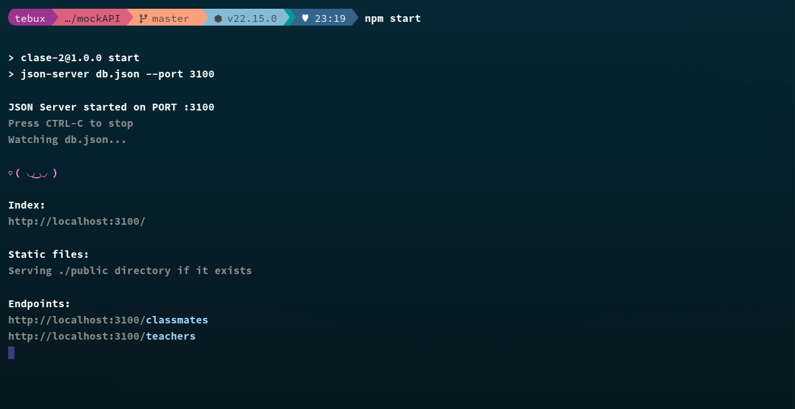

# Configuración de un Entorno Docker para Backend y Frontend

## 1. Título

Implementación de Entornos Aislados para Backend y Frontend con Docker

## 2. Tiempo de duración

1 hora y 30 minutos

## 3. Fundamentos:

En esta práctica se trabajó en la creación de contenedores Docker para el despliegue simultáneo de una aplicación backend y frontend. El objetivo principal fue aislar ambos servicios en contenedores independientes utilizando Docker y establecer una red de comunicación entre ellos, simulando un entorno de desarrollo profesional.

Se creó un contenedor para el frontend desarrollado en React y otro para el backend construido con Express en Node.js. Se utilizaron imágenes oficiales de Node y se definieron los pasos de construcción en archivos `Dockerfile` específicos para cada servicio. 

Esta práctica permitió reforzar el conocimiento sobre Docker y su aplicación en el ciclo de vida del desarrollo de software, fomentando buenas prácticas de encapsulamiento, portabilidad, y despliegue automático. También se trabajó con conceptos como volúmenes, instalación de dependencias dentro de los contenedores, y la estructura de carpetas para proyectos Dockerizados.

## 4. Conocimientos previos.

Para realizar esta práctica el estudiante necesita tener claro los siguientes temas:

- Uso básico de Docker (comandos, imágenes, contenedores).
- Conocimiento de arquitectura cliente-servidor.
- Conceptos de puertos y redes.
- Uso de terminal y sistemas basados en Linux.
- Estructura de aplicaciones web en React y Express.

## 5. Objetivos a alcanzar

- Ejecutar servicios backend y frontend en contenedores Docker separados.
- Comprender la orquestación de múltiples contenedores usando `docker-compose`.
- Comunicar dos contenedores de una misma red definida por Docker.
- Implementar una arquitectura moderna usando contenedores para el desarrollo.

## 6. Equipo necesario:

- Computador con sistema operativo Windows o Linux.
- Docker Desktop instalado y funcionando.
- Visual Studio Code o editor de texto.
- Conexión a internet para descarga de imágenes de Docker Hub.

## 7. Material de apoyo.

- [Documentación oficial de Docker](https://docs.docker.com/)
- [Documentación oficial de React](https://reactjs.org/)
- [Documentación oficial de Express](https://expressjs.com/)
- Video guía alojado en la plataforma del Instituto: https://drive.google.com/file/d/1OitqZ02pX7VHaVx3qH9eF31mQent65rk/view

## 8. Procedimiento

### Paso 1: Iniciar la estructura del proyecto con los repositorios

```bash
git clone https://github.com/Daviddotcoms/suda-frontend-s6.git
git clone https://github.com/Daviddotcoms/mockAPI.git

## Ejecutar backend  -- solo verificamos, luego apagamos el backend.
cd mockAPI
npm install
npm run 

##Verificar Front
```


  
    

### Paso 2: Crear y configurar el Sockerfile

```bash
# Etapa 1: Compilación de la aplicación
FROM node:18-alpine as build

WORKDIR /app
COPY . .
RUN npm install
RUN npm run build

# Etapa 2: Servidor Nginx para servir la app
FROM nginx:alpine
COPY --from=build /app/dist /usr/share/nginx/html

EXPOSE 80
CMD ["nginx", "-g", "daemon off;"]
```


### Paso 3 Crear imagen docker

```bash
docker build -t suda-frontend .
```


### Paso 4: Crear el contenedor

```bash
docker run -d -p 5173:80 --name suda-frontend-container suda-frontend
```

### Paso 5: Verificar funcionamiento:


## 9. Resultados esperados:
 Contenedor frontend ejecutándose en el puerto 3000 con React.

Contenedor backend funcionando en el puerto 3001 con Express.

Comunicación entre contenedores a través de la red definida en docker-compose.

El mensaje del backend mostrado correctamente en la interfaz del frontend.

Código fuente bien organizado, y archivos Dockerfile funcionales para cada servicio.

Comprensión clara de cómo Docker facilita el despliegue y desarrollo multiplataforma.

## 10. Bibliografía
Docker Docs. (s.f.). Docker Documentation. Recuperado de https://docs.docker.com

React Developers. (s.f.). React Documentation. Recuperado de https://reactjs.org/docs

Express. (s.f.). Express Documentation. Recuperado de https://expressjs.com

## 11.Audio
[Audio](https://drive.google.com/file/d/122IWrpAwmtxkigXX64zQ7xG268o-V4OR/view?usp=sharing)
