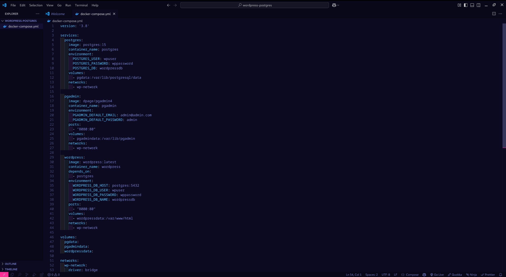

# Contenerización de WordPress con PostgreSQL y pgAdmin usando Docker Compose

## 1. Título  
Contenerización de WordPress con PostgreSQL y pgAdmin usando Docker Compose

## 2. Tiempo de duración  
90 minutos

## 3. Fundamentos  

Docker permite empaquetar aplicaciones y sus dependencias en contenedores, asegurando que funcionen de forma consistente en cualquier entorno.  
En esta práctica, se crea y orquesta un entorno de WordPress con base de datos PostgreSQL y su administrador pgAdmin, ejecutándose en contenedores Docker separados y comunicándose a través de una red Docker definida en Docker Compose.  
Se configuran volúmenes para persistencia de datos y puertos para acceso desde el host.

## 4. Conocimientos previos  

- Fundamentos de WordPress y bases de datos PostgreSQL  
- Comandos básicos de Docker y Docker Compose  
- Conceptos de redes en Docker  
- Variables de entorno en Docker  
- Administración básica de pgAdmin  

## 5. Objetivos a alcanzar  

- Crear contenedores Docker para WordPress, PostgreSQL y pgAdmin  
- Configurar una red Docker personalizada para la comunicación entre contenedores  
- Definir volúmenes Docker para persistencia de datos  
- Exponer puertos para acceso desde navegador a WordPress y pgAdmin  
- Levantar el entorno completo con docker-compose  

## 6. Equipo necesario  

- Computadora con Docker y Docker Compose instalados  
- Navegador web para acceder a WordPress y pgAdmin  
- Editor de texto para crear archivos YAML  

## 7. Material de apoyo  

- [Documentación oficial de Docker](https://docs.docker.com/)  
- [WordPress Docker Hub](https://hub.docker.com/_/wordpress)  
- [PostgreSQL Docker Hub](https://hub.docker.com/_/postgres)  
- [pgAdmin Docker Hub](https://hub.docker.com/r/dpage/pgadmin4)  

## 8. Procedimiento  

### Paso 1: Crear el archivo `docker-compose.yml`  

Crear un archivo `docker-compose.yml` con el siguiente contenido:  

```yaml
services:
  wordpress:
    image: wordpress:latest
    depends_on:
      - db
    environment:
      WORDPRESS_DB_HOST: db:5432
      WORDPRESS_DB_USER: wpuser
      WORDPRESS_DB_PASSWORD: wppassword
      WORDPRESS_DB_NAME: wordpressdb
    ports:
      - "8000:80"
    volumes:
      - wordpress_data:/var/www/html
    networks:
      - wp-network

  db:
    image: postgres:latest
    environment:
      POSTGRES_USER: wpuser
      POSTGRES_PASSWORD: wppassword
      POSTGRES_DB: wordpressdb
    volumes:
      - db_data:/var/lib/postgresql/data
    networks:
      - wp-network

  pgadmin:
    image: dpage/pgadmin4
    environment:
      PGADMIN_DEFAULT_EMAIL: admin@admin.com
      PGADMIN_DEFAULT_PASSWORD: adminpassword
    ports:
      - "5050:80"
    volumes:
      - pgadmin_data:/var/lib/pgadmin
    depends_on:
      - db
    networks:
      - wp-network

volumes:
  wordpress_data:
  db_data:
  pgadmin_data:

networks:
  wp-network:
    driver: bridge
```



### Paso 2: Construir y levantar los contenedores
Ejecutar los siguientes comandos en la terminal:

```bash
docker compose up -d
```
Este comando descargará las imágenes (si no las tienes), creará los contenedores y levantará el entorno.


### Paso 3: Acceder a los servicios
- WordPress: Abrir en navegador http://localhost:8000 para iniciar la configuración de WordPress.

- pgAdmin: Abrir en navegador http://localhost:5050 e iniciar sesión con:

Usuario: admin@admin.com
Contraseña: adminpassword
Desde pgAdmin podrás conectar a la base de datos PostgreSQL usando los siguientes datos:
Hostname/address: db
Puerto: 5432
Usuario: wpuser
Contraseña: wppassword


## 9. Resultados esperados:
- WordPress debe estar accesible en http://localhost:8000 funcionando correctamente y conectado a PostgreSQL.

- pgAdmin debe estar accesible en http://localhost:5050 y permitir administrar la base de datos PostgreSQL.

- Los contenedores deben estar comunicados dentro de la red wp-network.

- Los datos de WordPress y PostgreSQL deben persistir gracias a los volúmenes Docker definidos.

## 10. Bibliografía
- Docker. (s.f.). Docker Documentation. Recuperado de https://docs.docker.com/

- WordPress Docker Hub. (s.f.). Recuperado de https://hub.docker.com/_/wordpress

- PostgreSQL Docker Hub. (s.f.). Recuperado de https://hub.docker.com/_/postgres

- pgAdmin Docker Hub. (s.f.). Recuperado de https://hub.docker.com/r/dpage/pgadmin4

[Audio explicativo práctica]()
