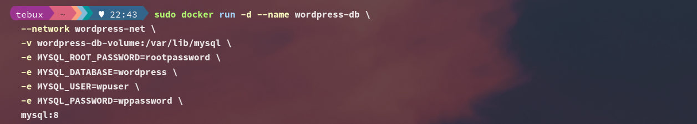

# Práctica Servidor Web con Docker: WordPress, MySQL y phpMyAdmin

## 1. Título
Implementación de un servidor web con WordPress y base de datos MySQL en contenedores Docker

## 2. Tiempo de duración
90 minutos

## 3. Fundamentos

Docker es una plataforma de contenedores que permite empaquetar aplicaciones con todas sus dependencias en un solo entorno portátil. Para montar un servidor web moderno como WordPress, se requiere una base de datos (MySQL) y un servidor HTTP (Apache/Nginx) que se ejecutan de forma independiente y se comunican mediante una red definida por el usuario.

En esta práctica, se aprovechan las capacidades de Docker para aislar servicios: WordPress como servidor web y gestor de contenido, MySQL como gestor de base de datos, y phpMyAdmin como herramienta visual de administración de la base de datos.

La arquitectura de la solución se basa en una red personalizada (`wordpress-net`) que permite la comunicación entre los contenedores. Se asignan puertos específicos para acceder al frontend de WordPress (8081) y a phpMyAdmin (8080).

DIAGRAMA DE CONTENEDORES:


## 4. Conocimientos previos

Para realizar esta práctica el estudiante necesita tener claro los siguientes temas:

- Comandos básicos de Linux (cd, ls, mkdir, etc.)
- Comandos Docker (`docker run`, `docker ps`, `docker network`, etc.)
- Navegación web y uso básico del navegador
- Conceptos básicos de bases de datos relacionales
- Fundamentos de cliente-servidor en aplicaciones web

## 5. Objetivos a alcanzar

- Implementar contenedores con MySQL, WordPress y phpMyAdmin utilizando Docker.
- Manipular archivos de configuración y variables de entorno para contenedores.
- Crear una red personalizada de Docker para conectar los servicios.
- Visualizar la base de datos a través de phpMyAdmin.
- Acceder a la interfaz de WordPress desde un navegador.

## 6. Equipo necesario

- Computador con sistema operativo Windows / Linux / MacOS
- Docker instalado (versión 20.10 o superior)
- Conexión a Internet
- Editor de texto o terminal
- Navegador web (Firefox, Chrome, etc.)

## 7. Material de apoyo

- [Documentación oficial de Docker](https://docs.docker.com/)
- Guía de asignatura
- Cheat Sheet de comandos Linux
- Tutoriales en línea sobre WordPress y MySQL en contenedores

## 8. Procedimiento

### Paso 1: Crear una red personalizada de Docker

```
sudo docker network create wordpress-net
```


- Figura 1. Creación de red de contenedores.

### Paso 2: Crear un volumen:
```
sudo docker volume create wordpress-db-volume

```


### Paso 3: Crear contenedor de MySQL

```
sudo docker run -d --name wordpress-db \
  --network wordpress-net \
  -v wordpress-db-volume:/var/lib/mysql \
  -e MYSQL_ROOT_PASSWORD=rootpassword \
  -e MYSQL_DATABASE=wordpress \
  -e MYSQL_USER=wpuser \
  -e MYSQL_PASSWORD=wppassword \
  mysql:8.0

```



- Figura 3. Creación de contenedor de MySQL.


### Paso 4:Creación de contenedor de Wordpress.

```
sudo docker run -d --name wordpress-site \
  --network wordpress-net \
  -p 8081:80 \
  -e WORDPRESS_DB_HOST=wordpress-db:3306 \
  -e WORDPRESS_DB_USER=wpuser \
  -e WORDPRESS_DB_PASSWORD=wppassword \
  -e WORDPRESS_DB_NAME=wordpress \
  wordpress:latest

```

- Figura 4: Creación de contenedor de Wordpress.


### Paso 5: Crear contenedor de phpMyAdmin.

```
sudo docker run -d --name wordpress-phpmyadmin \
  --network wordpress-net \
  -p 8080:80 \
  -e PMA_HOST=wordpress-db \
  phpmyadmin/phpmyadmin

```

- Figura 5: Creación de contenedor de PhpMyAdmin.

### Paso 6:Acceder a los servicios desde el navegador

- WordPress: http://localhost:8081
- phpMyAdmin: http://localhost:8080


- Figura 6: PhpMyAdmin desde el navegador.


- Figura 6: WordPress desde el navegador.

## 9. Resultados esperados:
    
WordPress accesible en el navegador configurado con una base de datos funcional.

phpMyAdmin disponible para visualizar y administrar la base de datos MySQL.

Todos los contenedores ejecutándose de forma estable y comunicándose entre sí mediante la red personalizada de Docker.

Se puede visualizar correctamente la interfaz de instalación de WordPress y acceder a phpMyAdmin con el usuario wpuser.


## 10. Bibliografía

- Docker, Inc. (s.f.). *Docker Documentation*. Recuperado de https://docs.docker.com/

- WordPress.org. (s.f.). *WordPress Documentation*. https://wordpress.org/support/

- MySQL. (s.f.). *MySQL Documentation*. https://dev.mysql.com/doc/

- phpMyAdmin. (s.f.). *phpMyAdmin Official Docs*. https://docs.phpmyadmin.net/

- Torres, J. (2022). *Administración de sistemas GNU/Linux*. Editorial Alfaomega.


## Audio Explicativo:

[Audio explicativo práctica Wordpress](https://drive.google.com/file/d/1-ll-PCdY4fBoQODOjlWQkAXoWkIRsKoD/view?usp=sharing)